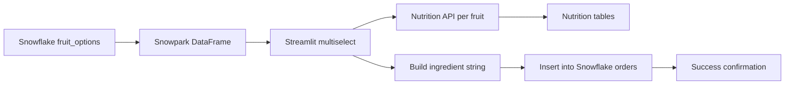

<div align="center">

<sub>Real photography by <a href="https://unsplash.com/photos/someone-is-holding-a-refreshing-fruity-smoothie-EMnBbQi0N_o">Esra Afşar on Unsplash</a>.</sub>

# Snowflake Smoothies
### A small Streamlit ordering experience backed by Snowpark, live nutrition data, and Snowflake tables.


[Experience](#experience) · [Data flow](#data-flow) · [Setup](#run-locally) · [Engineering](#engineering-notes)
</div>

---

## Overview

Snowflake Smoothies is a compact data-application project built with Streamlit. It reads available fruit ingredients from a Snowflake table through Snowpark, lets a customer select up to five items, enriches each selection with a fruit-nutrition API, then writes the submitted name and ingredient string to a Snowflake orders table.

## Experience

- Customer name input and immediate order preview
- Live ingredient options loaded from `smoothies.public.fruit_options`
- Maximum of five selected fruits
- Per-fruit lookup keys from the `SEARCH_ON` column
- Nutrition responses rendered as Streamlit dataframes
- Order confirmation after database insertion

## Data flow



## Run locally

```bash
git clone https://github.com/TanishC4444/Snowflake_smoothies.git
cd Snowflake_smoothies
python -m venv .venv
source .venv/bin/activate
python -m pip install -r requirements.txt
streamlit run streamlit_app.py
```

Configure a Streamlit connection named `snowflake` with permission to:

- select `SMOOTHIES.PUBLIC.FRUIT_OPTIONS`;
- insert into `SMOOTHIES.PUBLIC.ORDERS`.

Store credentials in `.streamlit/secrets.toml` locally or the deployment secret manager, never in the repository.

## Expected data contract

```text
fruit_options: FRUIT_NAME, SEARCH_ON
orders:        INGREDIENTS, NAME_ON_ORDER
```

`SEARCH_ON` is used to call `https://my.smoothiefroot.com/api/fruit/<value>` for nutrition enrichment.

## Repository map

```text
Snowflake_smoothies/
├── streamlit_app.py
├── requirements.txt
└── README.md
```

## Engineering notes

- Snowpark keeps table access native to the Snowflake session.
- The ingredient cap is enforced directly in the UI.
- API and database calls currently lack explicit timeout/error handling.
- The SQL insert is assembled with string interpolation; parameterization/escaping is required before accepting untrusted input.
- The fruit-options dataframe is passed directly to `multiselect`; using a clean list from the `FRUIT_NAME` column would make the contract clearer.
- There is no schema/bootstrap script or automated test.

## Skills demonstrated

Streamlit product development · Snowpark/Snowflake integration · external API enrichment · dataframe interop · database writes · secrets-based connection configuration

## Resume-ready highlight

> Built an interactive Streamlit ordering app that loads ingredient inventory through Snowpark, enriches selections with live nutrition data, enforces product constraints, and persists customized orders to Snowflake.

## License

No license file is currently included.

